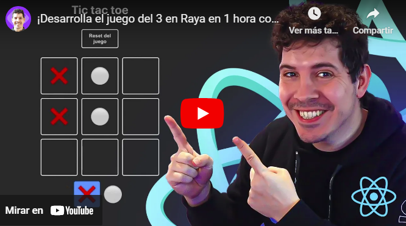

<a name="readme-top"></a>

<div align="center" style="text-align: center">
    
  <h1><b>Tic Tac Toe</b></h1>
</div>
<!-- TABLE OF CONTENTS -->

# 📗 Table of Contents

- [📖 About the Project](#about-project)
  - [🛠 Built With](#built-with)
    - [Tech Stack](#tech-stack)
    - [Key Features](#key-features)
  - [🚀 Live Demo](#live-demo)
- [💻 Getting Started](#getting-started)
  - [Setup](#setup)
  - [Prerequisites](#prerequisites)
  - [Install](#install)
  - [Usage](#usage)
  - [Run tests](#run-tests)
  - [Deployment](#triangular_flag_on_post-deployment)
- [👥 Authors](#authors)
- [🔭 Future Features](#future-features)
- [🤝 Contributing](#contributing)
- [⭐️ Show your support](#support)
- [🙏 Acknowledgements](#acknowledgements)
- [❓ FAQ](#faq)
- [📝 License](#license)

<!-- PROJECT DESCRIPTION -->

# 📖 [Tic Tac Toe] <a name="about-project"></a>

**Tic Tac Toe** Es un proyecto simulando el juego tres en raya, elaborando siguiendo el video de Miguel Angel Duran @midudev.

## 🛠 Built With <a name="built-with"></a>
<a href='https://www.youtube.com/embed/oWPFcuH8x6M?si=hBRr1Oss0tku8IlS' target='_blank'>
  
</a>

### Tech Stack <a name="tech-stack"></a>

<details>
  <summary>Client</summary>
  <ul>
    <li><a href="https://es.react.dev/">React</a></li>
    <li><a href="https://developer.mozilla.org/es/docs/Web/JavaScript">JavaScript</a></li>
    <li><a href="https://developer.mozilla.org/es/docs/Web/CSS">CSS</a></li>
  </ul>
</details>

<details>
<summary>Framework</summary>
  <ul>
    <li><a href="https://vitejs.dev/">Vite.js</a></li>
  </ul>
</details>

<!-- Features -->

### Key Features <a name="key-features"></a>

- Manejo de React
- Utilizacion de Hooks
- Basado en Vite.js

<p align="right">(<a href="#readme-top">back to top</a>)</p>

<!-- LIVE DEMO -->

## 🚀 Live Demo <a name="live-demo"></a>

- [Live Demo Link](https://tic-tac-toe-larrydev.netlify.app/)

<p align="right">(<a href="#readme-top">back to top</a>)</p>

GETTING STARTED

## 💻 Getting Started <a name="getting-started"></a>

To get a local copy up and running, follow these steps.

### Setup

Clone this repository to your desired folder:

Example commands:

```sh
  cd my-folder
  git clone git@github.com:LarryIVC/tic-tac-toe.git
```

### Usage

To run the project, execute the following command:

<p align="right">(<a href="#readme-top">back to top</a>)</p>

<!-- AUTHORS -->

## 👥 Authors <a name="authors"></a>

# 👤 **Larry Villegas**

- GitHub: [@LarryIVC](https://github.com/LarryIVC)
- Twitter: [@LarryVillegas](https://twitter.com/LarryVillegas)
- LinkedIn: [LinkedIn](https://www.linkedin.com/in/larryvillegascostas/)

<p align="right">(<a href="#readme-top">back to top</a>)</p>

<!-- FUTURE FEATURES -->

## 🔭 Future Features <a name="future-features"></a>

<p align="right">(<a href="#readme-top">back to top</a>)</p>

<!-- CONTRIBUTING -->

## 🤝 Contributing <a name="contributing"></a>

Contributions, issues, and feature requests are welcome!

Feel free to check the [issues page](https://github.com/LarryIVC/tic-tac-toe/issues).

<p align="right">(<a href="#readme-top">back to top</a>)</p>

<!-- SUPPORT -->

## ⭐️ Show your support <a name="support"></a>

Help me with your criticisms and your suggestions, you will be blessed for such a noble gesture and give me a ⭐️ if you like this project. click [here ⭐️](https://github.com/LarryIVC/tic-tac-toe)

<p align="right">(<a href="#readme-top">back to top</a>)</p>

<!-- ACKNOWLEDGEMENTS -->

## 🙏 Acknowledgments <a name="acknowledgements"></a>

I would like to thank @midudev for his videos.<br>

<p align="right">(<a href="#readme-top">back to top</a>)</p>

<!-- LICENSE -->

## 📝 License <a name="license"></a>

This project is [MIT](./LICENSE) licensed.

<p align="right">(<a href="#readme-top">back to top</a>)</p>
